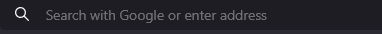

# BasicFullStackReactCsharp

## Project Overview

**BasicFullStackReactCsharp** is a full-stack web application that demonstrates a RESTful API for CRUD operations on a **Message** model.  
The backend is built using C# with .NET 8.0 following the MVC architecture and utilizes an in-memory data service for rapid development and testing.  
The frontend is developed with React, TypeScript, and Vite, and it leverages a custom `useApi` hook along with `useState` for handling asynchronous API requests using `fetch`.  
CORS is configured to ensure secure cross-origin communication, and Swagger is used for interactive API documentation.

---

## Table of Contents

- [Demo Showcase](#demo-showcase)
- [Key Features](#key-features)
- [Installation and Setup](#installation-and-setup)
  - [Prerequisites](#prerequisites)
  - [Backend Setup](#backend-setup)
  - [Frontend Setup](#frontend-setup)
- [Usage](#usage)
  - [CRUD Operation Buttons Explained](#crud-operation-buttons-explained)
- [Technologies Used](#technologies-used)
- [Project Structure](#project-structure)
- [License](#license)
- [Contributing](#contributing)

---

## Demo Showcase

---

## Key Features

- **MVC Architecture:** Organizes the backend into Models, Views, and Controllers for a clean separation of concerns.
- **Asynchronous Operations:** All methods are implemented asynchronously using `fetch` on both the backend and frontend, ensuring a responsive user experience.
- **In-Memory Data Service:** Provides a lightweight and fast data store ideal for development and demos.
- **Custom useApi Hook:** Located in `useApi.ts`, it simplifies API communication by managing asynchronous requests and state using `useState`.
- **CORS Enabled:** Ensures secure cross-origin requests between the client and server.
- **Swagger Documentation:** Offers interactive API documentation to facilitate testing and development.
- **Vite-Powered Frontend:** Enables rapid development, hot module replacement, and optimized builds.
- **Exception Filter and Error handling:** used exceptions `throws`, `try-catch`, and exception filter to handle the exceptions and unexpected behavior in the code.

---

## Installation and Setup

### Prerequisites

- **.NET 8.0 SDK:** [Download here](https://dotnet.microsoft.com/download/dotnet/8.0)
- **Node.js (v16 or later):** [Download here](https://nodejs.org/)
- **Visual Studio Code**
- **Git**

### Backend Setup

1. **Navigate to the Backend Folder:**

       cd BackendCsharp

2. **Restore Dependencies and Build:**

       dotnet restore
       dotnet build

3. **Run the API:**

       dotnet run

4. **Access the API:**  
   The API will typically run on `http://localhost:5194` (or as configured in your launchSettings.json).

### Frontend Setup
1. **Navigate to the Frontend Folder:**

       cd FrontendReact

2. **Install Dependencies:**

       npm install

3. **Start the Client Development Environment:**

       npm run dev

4. **Access the App:**  
   The React application will run on `http://localhost:5173/`.

---

## Usage

After setting up both the backend and frontend, the application can be accessed at [http://localhost:5173](http://localhost:5173).

- **API Documentation:**  
  View the interactive Swagger documentation at [http://localhost:5194/swagger/](http://localhost:5194/swagger/).

### CRUD Operation Buttons Explained

The UI includes buttons that trigger asynchronous API calls using the `fetch` API. The following endpoints are called when clicking the buttons:

- **Get:**  
  Retrieves a single message asynchronously.  
  **Example URL:** `http://localhost:5194/api/messages/1`  
  *Use this button to view detailed information for a specific message.*

- **Get All:**  
  Fetches and displays all messages asynchronously from the in-memory data service.  
  **Example URL:** `http://localhost:5194/api/messages/`  
  *Click this button to view a complete list of messages.*

- **Add:**  
  Creates a new message asynchronously by sending the provided details with a POST request.  
  **Example URL:** `http://localhost:5194/api/messages/`  
  *Enter message body and use this button to add a new message*

- **Update:**  
  Modifies an existing message asynchronously by sending updated data with a PUT request.  
  **Example URL:** `http://localhost:5194/api/messages/1`  
  *Enter message id and message body, and click this button to update the message.*

- **Delete:**  
  Removes a message asynchronously from the in-memory data service by sending a DELETE request.  
  **Example URL:** `http://localhost:5194/api/messages/1`  
  *Enter message id and use this button to delete the message permanently.

Each button operation is handled asynchronously to ensure smooth and responsive interactions.

---

## Technologies Used

- **Backend:**
  - **C# & .NET 8.0:** For building the RESTful API.
  - **MVC Architecture:** Structures the backend into Models, Views, and Controllers.
  - **In-Memory Data Service:** Offers a simple and fast data store for development and demo purposes.
  - **CORS Configuration:** Enables secure cross-origin requests.
  - **Swagger:** Provides interactive API documentation and testing tools.

- **Frontend:**
  - **React:** For building the dynamic user interface.
  - **TypeScript:** Enhances code reliability with static typing.
  - **Vite:** Powers fast development and optimized builds.
  - **Custom useApi Hook:** Located in `useApi.ts`, it handles asynchronous API calls using `fetch`.
  - **useState:** Manages state within the React components (e.g., in `App.tsx`).

---

## Project Structure

*(Project structure details will be added later.)*

---

## License

This project is licensed under the MIT License. See the [LICENSE](LICENSE) file for more details.

---

## Contributing

*(Content coming soon.)*
